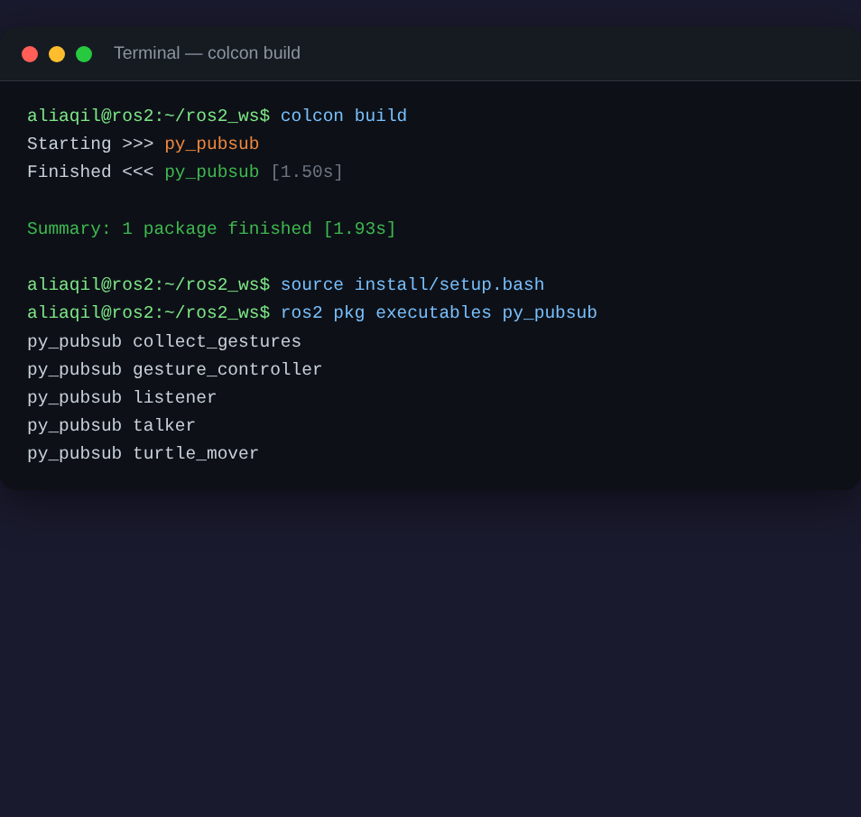
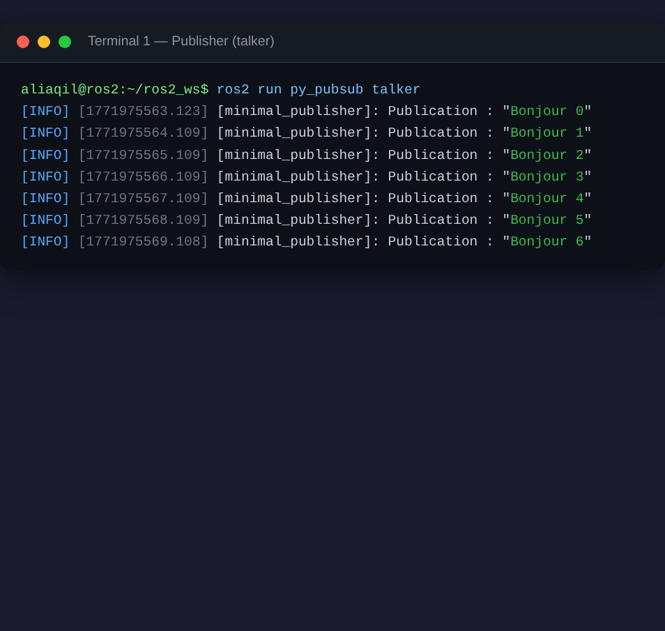
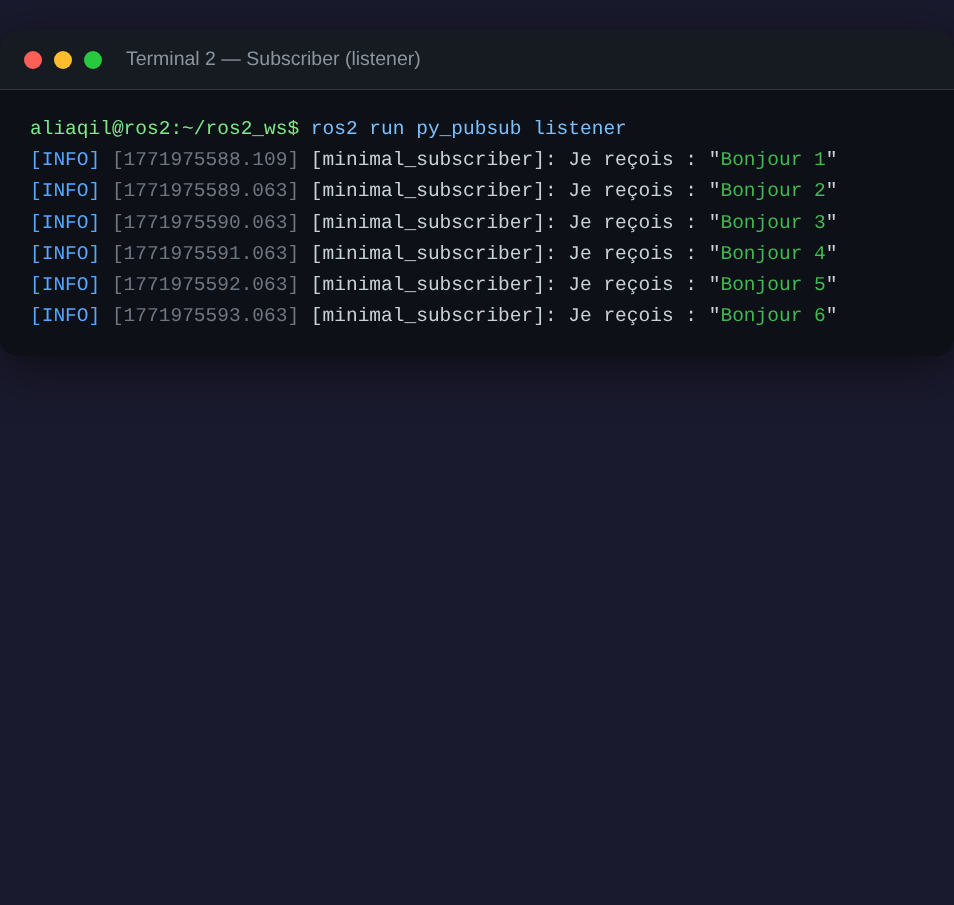
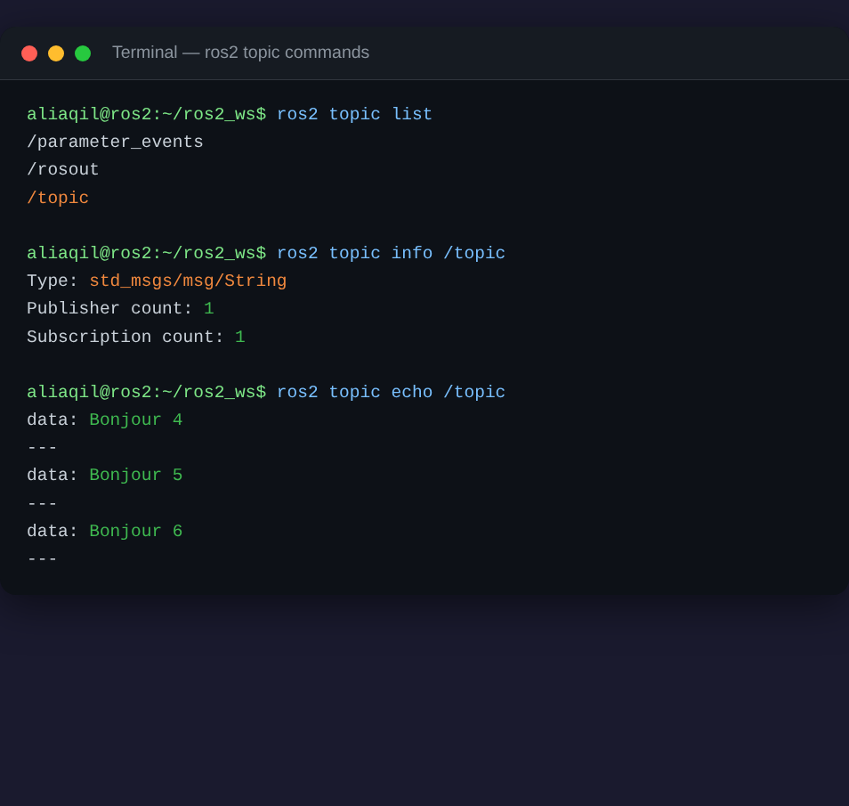
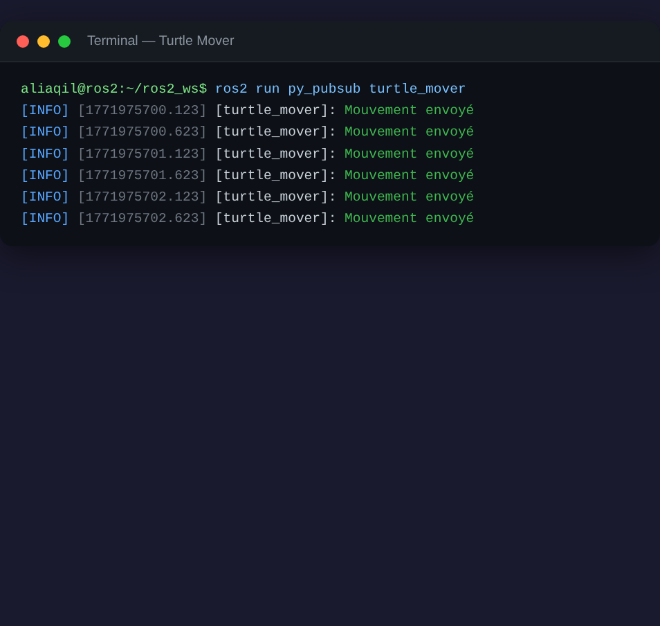

# 🤖 ROS 2 TP — Publisher/Subscriber, Turtlesim & Gesture Control

> **TP 1 : Premiers pas avec ROS 2 et Python** — 2IA, ENSIAS

A comprehensive ROS 2 Humble project that progresses from basic publisher/subscriber nodes to controlling a turtlesim turtle using **deep learning hand gesture recognition**.

---

## 📁 Project Structure

```
ros2_ws/
└── src/
    └── py_pubsub/
        ├── package.xml
        ├── setup.py
        ├── setup.cfg
        ├── resource/
        │   └── py_pubsub
        └── py_pubsub/
            ├── __init__.py
            ├── publisher_node.py        # Part 1: Publisher
            ├── subscriber_node.py       # Part 1: Subscriber
            ├── turtle_mover.py          # Part 2: Turtlesim mover
            ├── collect_gestures.py      # Part 3: Dataset collection
            ├── gesture_model.py         # Part 3: CNN model
            ├── train_model.py           # Part 3: Training script
            ├── recognize_gestures.py    # Part 3: Real-time recognition
            └── gesture_control_node.py  # Part 3: ROS 2 gesture controller
```

---

## 🚀 Getting Started

### Prerequisites

- **Ubuntu 22.04** with **ROS 2 Humble**
- Python 3.10+
- PyTorch, OpenCV, scikit-learn

```bash
# Install ROS 2 Humble (if not installed)
# https://docs.ros.org/en/humble/Installation.html

# Install Python dependencies
pip install torch torchvision opencv-python scikit-learn Pillow
```

### Build the Workspace

```bash
cd ~/ros2_ws
colcon build
source install/setup.bash
```

**Build output:**



---

## 📡 Part 1 — Publisher & Subscriber

### Run the Publisher (Terminal 1)
```bash
source ~/ros2_ws/install/setup.bash
ros2 run py_pubsub talker
```

**Publisher output:**



### Run the Subscriber (Terminal 2)
```bash
source ~/ros2_ws/install/setup.bash
ros2 run py_pubsub listener
```

**Subscriber output (receiving messages from the publisher):**



### Topic Inspection
```bash
ros2 topic list                # List all active topics
ros2 topic info /topic         # Get topic info
ros2 topic echo /topic         # See messages on the topic
```

**Topic commands output:**



---

## 🐢 Part 2 — Turtlesim Control

### Launch Turtlesim (Terminal 1)
```bash
ros2 run turtlesim turtlesim_node
```

### Keyboard Control (Terminal 2)
```bash
ros2 run turtlesim turtle_teleop_key
```

### Automated Movement Script (Terminal 2)
```bash
ros2 run py_pubsub turtle_mover
```

**Turtle mover output:**



### Observe Turtle Position
```bash
ros2 topic echo /turtle1/pose
```

---

## 🖐️ Part 3 — Deep Learning Gesture Control

### Step 1: Collect Gesture Data

```bash
python3 -m py_pubsub.collect_gestures --output_dir ./gesture_data --num_images 200
```

**Controls:**
| Key | Action |
|-----|--------|
| `u` | Switch to **up** class |
| `d` | Switch to **down** class |
| `l` | Switch to **left** class |
| `r` | Switch to **right** class |
| `s` | Start/stop capturing |
| `q` | Quit |

> **💡 Tip:** Collect at least **100–200 images per class** for a simple CNN. Use varied backgrounds and hand positions.

### Step 2: Train the Model

```bash
python3 -m py_pubsub.train_model --data_dir ./gesture_data --epochs 20 --batch_size 32
```

The training script will:
- Split data into train/validation (80/20)
- Train the CNN with Adam optimizer
- Print accuracy and loss per epoch
- Save the best model to `gesture_model.pth`
- Display a confusion matrix and classification report

### Step 3: Test Recognition (standalone)

```bash
python3 -m py_pubsub.recognize_gestures --model ./gesture_model.pth
```

### Step 4: Control Turtlesim with Gestures

```bash
# Terminal 1: Launch turtlesim
ros2 run turtlesim turtlesim_node

# Terminal 2: Run gesture controller
ros2 run py_pubsub gesture_controller --ros-args -p model_path:=./gesture_model.pth
```

**Gesture → Command Mapping:**

| Gesture | Command | Description |
|---------|---------|-------------|
| ☝️ Up | `linear.x = 2.0` | Move forward |
| 👇 Down | `linear.x = -2.0` | Move backward |
| 👈 Left | `angular.z = 1.5` | Turn left |
| 👉 Right | `angular.z = -1.5` | Turn right |

---

## 🧠 Model Architecture

```
GestureCNN
├── Conv2d(3 → 32, 3×3) + ReLU + MaxPool(2×2)
├── Conv2d(32 → 64, 3×3) + ReLU + MaxPool(2×2)
├── Flatten
├── Linear(64×16×16 → 128) + ReLU + Dropout(0.5)
└── Linear(128 → 4)
```

**Input:** 64×64 RGB images | **Output:** 4 classes (up, down, left, right)

---

## ❓ TP Questions & Answers

### Image Quality Improvement
- **Cropping**: ROI extraction focuses on the hand region
- **Normalization**: ImageNet mean/std normalization
- **Augmentation**: Random flips, rotation (±15°), color jitter

### Why ReLU?
Without non-linear activations, stacking linear layers produces a single linear transformation. ReLU enables the network to learn non-linear decision boundaries.

### Loss Functions for Classification
- **CrossEntropyLoss** (used here): standard for multi-class problems
- **FocalLoss**: handles class imbalance
- **LabelSmoothingCrossEntropy**: prevents overconfident predictions

### Evaluation Metrics
- **Accuracy**: overall correct predictions
- **Confusion Matrix**: per-class performance
- **Precision/Recall/F1**: detailed per-class metrics

### Prediction Stability
A **sliding window** of the last N predictions acts as a majority-vote temporal filter, smoothing frame-by-frame noise.

### Ideal Publishing Rate
~5 Hz provides fluid control without overwhelming turtlesim commands.

### System Limitations
- Lighting sensitivity
- Background-dependent performance
- Limited gesture vocabulary
- Webcam latency
- No depth information (2D only)

---

## 👤 Author

**Ali Aqil** — ENSIAS, 2IA

---

## 📜 License

Apache 2.0
